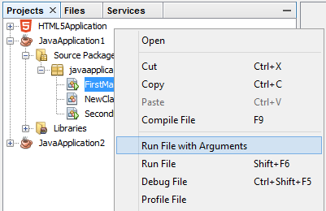
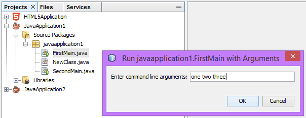

nbrunwithargs
=============

NetBeans Plugin providing Run with Arguments command to Java projects

''Works with
NetBeans IDE 8.0 and above

''Installation
Download the latest release NBM from releases and install using Plugin Manager dialog box.

''Working
This plugin added a menu option "Run with Arguments" to the Run menu for Java projects.
It also adds context menus to Java projects and Java files.

We can provide command line arguments for a Java project or even a single Java file.
